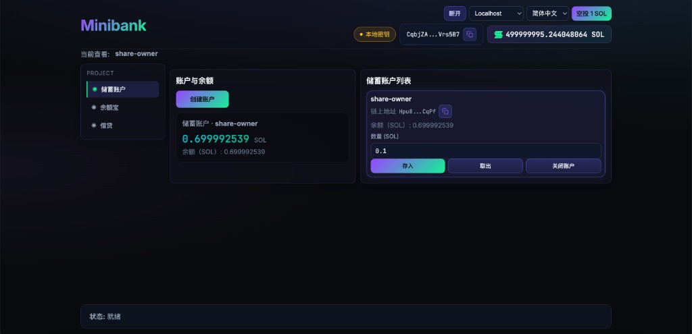
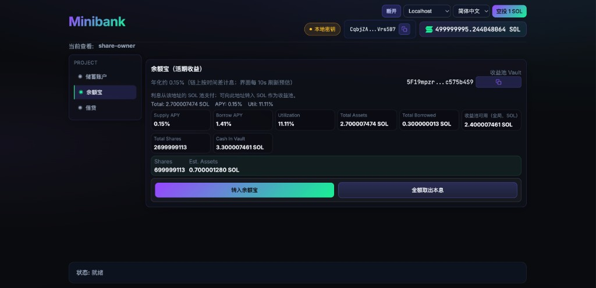
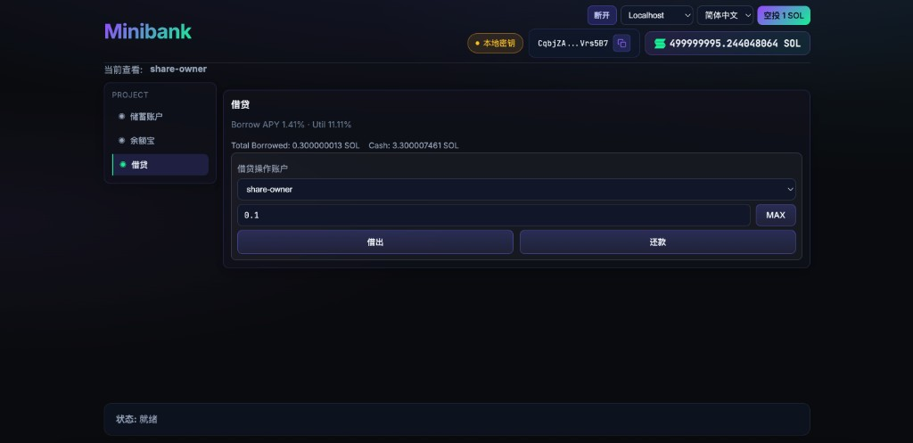

# Minibank

A minimal **Solana + Anchor** demo: per-user savings accounts (`MiniAccount` PDAs), deposits, withdrawals, account close, and a **余额宝-like yield position** backed by a global vault. Includes a **React + Vite** UI with wallet or local keypair signing.

## Repository layout

| Path | Description |
|------|-------------|
| `programs/minibank/` | Anchor program (`lib.rs`, `instructions/`, `state/`, `contexts.rs`, `error.rs`, `constants.rs`) |
| `app/` | Frontend (`npm run dev` / `npm run build`) |
| `tests/` | TypeScript integration tests (`anchor test`) |
| `target/idl/` | Generated IDL after `anchor build` (copy into `app/src/idl/` when the program changes) |

## Prerequisites

- Rust, Solana CLI, Anchor CLI
- Node.js (for frontend and tests)

## On-chain program

```bash
anchor build
anchor test
```

Deploy to the cluster configured in `Anchor.toml` (`[provider]`):

```bash
anchor deploy
```

The deployed program id must match `declare_id!` in `programs/minibank/src/lib.rs` and the IDL consumed by the app.

### Module layout (Rust)

- `programs/minibank/src/lib.rs` — program entry and `#[program]` dispatch
- `instructions/` — per-instruction handlers
- `state/` — `#[account]` structs (`MiniAccount`, `UserStats`, `UserYieldPosition`, `YieldVault`)
- `contexts.rs` — `#[derive(Accounts)]` validation contexts (named `contexts` because `#[program]` macro reserves a `accounts` module name at the crate root)
- `error.rs` — `#[error_code]`
- `constants.rs` — seeds and limits

### Yield feature (share-based vault)

Stage-1 protocol now uses a **share model** (instead of per-user accrued interest fields):

- `yield_deposit(account_id, amount)` mints user shares using:
  - `minted_shares = amount * total_shares / total_assets` (or `amount` when pool is empty)
- `yield_withdraw(target_account_id, amount)` burns shares based on requested assets
- User account stores `shares` only; value is derived by:
  - `user_assets = user_shares * total_assets / total_shares`

`YieldVault` tracks:

- `total_assets` (pool assets)
- `total_shares`
- `total_borrowed`
- `last_accrual_ts`

This means share count stays constant while per-share value can grow.

### Borrow/repay + utilization rate model

The pool includes borrow-side accounting:

- `borrow(target_account_id, amount)`
- `repay(source_account_id, amount)`

Interest is accrued globally before state-changing ops (`deposit/withdraw/borrow/repay`).

### APY / interest math (detailed)

All rates are integer math in **bps** (basis points):

- `1% = 100 bps`
- `100% = 10_000 bps`

Current on-chain constants (`programs/minibank/src/constants.rs`):

- `RATE_BASE_BPS = 100` (1%)
- `RATE_SLOPE1_BPS = 300` (kink 前最多 +3%)
- `RATE_SLOPE2_BPS = 3600` (kink 后最多 +36%)
- `RATE_KINK_UTIL_BPS = 8000` (80%)
- `SECONDS_PER_YEAR = 31_536_000`

#### 1) Utilization

- `util_bps = min(10_000, total_borrowed * 10_000 / total_assets)`
- When `total_assets == 0`, utilization is treated as `0`.

#### 2) Borrow APY (piecewise kink model)

If `util_bps <= kink`:

- `borrow_rate_bps = base + util_bps * slope1 / kink`

If `util_bps > kink`:

- `tail_util = util_bps - kink`
- `tail_range = 10_000 - kink`
- `borrow_rate_bps = base + slope1 + tail_util * slope2 / tail_range`

With current params, this yields approximately:

- `util=0%`   -> borrow APY `1%`
- `util=80%`  -> borrow APY `4%`
- `util=100%` -> borrow APY `40%`

So it is intentionally:

- **slow increase** under 80%
- **steep penalty** above 80%

#### 3) Supplier APY (display logic)

Frontend displays supply APY as:

- `supply_rate_bps = borrow_rate_bps * util_bps / 10_000`

This mirrors the common pool intuition: suppliers earn from borrower interest weighted by utilization.

#### 4) Time-based accrual (global compounding)

On each accrual:

- `elapsed = now - last_accrual_ts`
- `delta = total_borrowed * borrow_rate_bps * elapsed / 10_000 / SECONDS_PER_YEAR`

Then both vault sides are increased by the same `delta`:

- `total_borrowed += delta`
- `total_assets += delta`

This keeps accounting consistent and compounds yield at the pool level.

### Funding the reward pool

Yield does **not** appear from nowhere. For users to actually receive interest, someone must add SOL to the global vault beyond principal:

- In UI: use **Fund vault / 注资收益池** in the yield card.
- Or transfer SOL directly to the `YieldVault` PDA address shown in the app.

If reward pool is zero, users will still be able to redeem principal, but paid yield may be zero.

### Quick test flow (recommended)

1. Deposit some SOL from a savings account into yield (`yield_deposit`).
2. Deposit from another user and verify share ratio.
3. Borrow from the vault, wait a few seconds, then repay.
4. Observe `total_assets/total_shares` and user-estimated assets.
5. Withdraw (`yield_withdraw`) and verify burn-shares behavior.

## Frontend (`app/`)

```bash
cd app
npm install
npm run dev
```

### UI demos

Savings module:



Yield module:



Lending module:



### Environment

| Variable | Purpose |
|----------|---------|
| `VITE_SOLANA_RPC` | Optional. If set, used to choose initial RPC cluster (devnet vs localhost). The UI can still switch network in the header. |
| `VITE_LOCAL_KEYPAIR_JSON` | Optional. JSON array of byte values for a local dev keypair. If omitted, `vite.config.ts` can inject `~/.config/solana/id.json` at build time for convenience. |

Copy `app/.env.example` to `app/.env.local` and adjust.

### Connection & signing

- **Connect** opens a menu: browser wallet (Phantom / Solflare) or **local keypair** (same bytes as `id.json` / env).
- **Network** selector: **Devnet** (`https://api.devnet.solana.com`) or **Localhost** (`http://127.0.0.1:8899`). All reads and transactions use the selected RPC; local keypair only affects **who signs**, not which cluster unless you pick Localhost.

### Balance & cluster

- Native SOL balance comes from `connection.getBalance` against the **RPC endpoint** you selected. If you choose **Localhost** but no `solana-test-validator` is listening on `8899`, RPC calls will fail until you start a validator or switch back to Devnet.
- Keep the **program deployed** on the same cluster as the RPC URL; otherwise instructions will fail or point at the wrong program.

### IDL sync

After changing the program, run `anchor build` and copy the generated `target/idl/minibank.json` to `app/src/idl/minibank.json` (or your bundler path) so the client matches the on-chain IDL.

When account layout changes (for example, adding fields to `YieldVault`), make sure existing on-chain accounts are migrated/recreated in your test environment.

## License

ISC (see root `package.json`).
